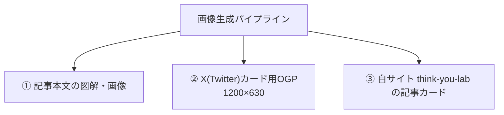
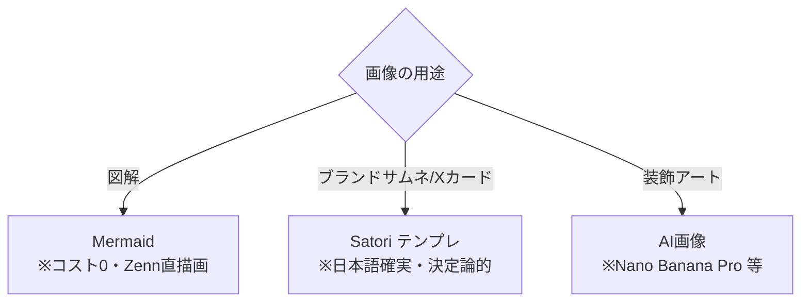
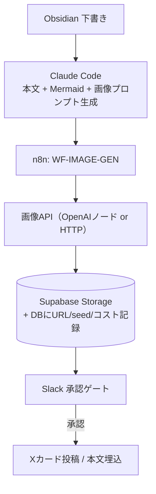

:::message
**📚 シリーズ「AIと自動化で副業システムを作る」全4回**
[①hooks](https://zenn.dev/thinkyou0714/articles/claude-code-hooks-47) / [②n8n全体像](https://zenn.dev/thinkyou0714/articles/n8n-claudecode-automation-overview) / [③Obsidian](https://zenn.dev/thinkyou0714/articles/obsidian-n8n-ai-pipeline) / ④画像パイプライン（本記事）
:::

## TL;DR

- 記事の図解・サムネ・X用カードを「文章と同じパイプライン」で自動生成するようにした
- 役割分担が肝：**図解=Mermaid（無料・Zenn直描画）／ブランドサムネ=Satoriテンプレ（日本語が確実に読める）／装飾アート=AI画像（CJKテキストはNano Banana Proが最強）**
- 重要な事実：**Zenn のOGPはタイトル+emojiから自動生成され、記事ごとのカスタムOGPは設定できない**。だからAI画像の出力先は「本文/Xカード/自サイト」に振り向ける
- AI画像は「自分のもの」として使えるが、米国判例では**著作権の独占は主張しにくい**。透かし（SynthID）と商用可否を理解した上で運用する

:::message
**検証環境**: n8n（セルフホスト）+ Claude Code + Supabase Storage + Anthropic/各画像API（2026年5月時点）。画像モデルの価格・仕様は変動が激しい。**価格はハードコードせず実行時に再確認**してほしい。
:::

:::details この記事の対象読者・前提・得られること

- **対象**: 技術ブログや SNS のビジュアル制作を自動化したい個人発信者
- **前提**: n8n など何らかの自動化ツールの基礎、Markdown でのブログ運用
- **得られること**: 図解 / サムネ / 装飾を役割分担で自動生成するパイプラインの設計と注意点
:::

---

## なぜ「画像も」自動化するのか

文章は自動化した。図解は手で描いていた。サムネは作っていなかった。

3記事書いて気づいた。**俺の記事には証拠になるビジュアルが一枚もなかった**。アーキ図はコードブロックのASCIIアート、サムネはZennのデフォルト、効果の数字は全部テキスト。読者からすれば「本当か？」を確かめる手がかりがない。

文章のパイプラインがあるなら、画像も同じレールに乗せればいい。そう考えて作ったのがこの画像生成パイプラインだ。

---

## まず潰すべき誤解：Zennのカスタムはできない

最初に大事な事実を共有する。**Zenn は記事のタイトルとemoji、著者名からOGP画像をサーバ側で自動生成する。記事ごとに好きなカバー画像を差し込む機能は存在しない**（要望は2020年から上がっているが未対応）。

だから「AIで作った映えるサムネをZennのOGPに設定する」はできない。画像の出力先は次の3つに振り向ける。



emojiは**唯一のサムネ要素**なので、一覧やSNSでの目立ちを意識して選ぶ。それ以外の「映え」はXカードと自サイトで稼ぐ。

---

## 3層の役割分担：ここが設計の核心

全部をAI画像に任せると、コストがかさみ、トーンがバラバラになり、文字が崩れる。だから用途で道具を分ける。

| 用途 | 道具 | 理由 |
|---|---|---|
| 記事内の図解（アーキ図/フロー） | **Mermaid** | Zennがネイティブ描画。コスト0、テキストなので差分管理可 |
| ブランドサムネ / Xカード | **Satori（@vercel/og）** | テンプレから決定論的に生成。日本語が確実に読める |
| ヒーロー/装飾アート | **AI画像（Nano Banana Pro 等）** | 映えるが一貫性は弱い。装飾に限定 |



### 図解は Mermaid 一択

Zenn は `mermaid` 指定のコードブロックをそのまま図に描画してくれる。Claude Code に「この本文を図にして」と頼めば Mermaid を吐く。**コスト0で、テキストだから差分レビューもできる**。

ひとつ注意。Zenn の mermaid は版が古めで横幅に制約がある。**縦方向の `graph TB` を基本**にしないとスマホで崩れる。D2 や Graphviz は Zenn では描画されないので、使うなら SVG/PNG に事前レンダして画像として貼る。

### サムネは Satori でテンプレ化

「映え」より「確実に読める日本語」と「ブランドの一貫性」が大事なサムネは、AI画像ではなく**HTML/CSS→画像**のテンプレで作る。`@vercel/og` の中身である Satori が定番だ。

```javascript:satori-card.mjs（Xカード生成）
import satori from 'satori';
import { Resvg } from '@resvg/resvg-js';
import fs from 'node:fs';

const font = fs.readFileSync('./NotoSansJP-Bold.ttf');

// 注意: Satori は flexbox のみ。CSS grid は使えない
const svg = await satori(
  {
    type: 'div',
    props: {
      style: {
        width: '100%', height: '100%', display: 'flex', flexDirection: 'column',
        justifyContent: 'space-between', padding: '64px',
        background: 'linear-gradient(135deg,#0f172a,#1e293b)', color: '#fff',
      },
      children: [
        { type: 'div', props: { style: { fontSize: 28, opacity: 0.7 }, children: 'THINK YOU LAB / 連載' } },
        { type: 'div', props: { style: { fontSize: 64, fontWeight: 700, lineHeight: 1.25 }, children: process.env.TITLE } },
        { type: 'div', props: { style: { fontSize: 28, opacity: 0.7 }, children: 'think-you-lab.vercel.app' } },
      ],
    },
  },
  { width: 1200, height: 630, fonts: [{ name: 'NotoSansJP', data: font, weight: 700, style: 'normal' }] }
);

const png = new Resvg(svg).render().asPng();
fs.writeFileSync('./card.png', png);
```

タイトルを変数で差し込むだけで、**同じトーンのカードが何枚でも、ピクセル単位で同一のレイアウトで**出てくる。AI画像では絶対に得られない一貫性だ。

### 装飾アートだけ AI に任せる

ヒーロー画像など「飾り」の部分だけAIに任せる。日本語の文字を画像内に入れたいなら、2026年時点では **Nano Banana Pro（Gemini 3 Pro Image）がCJK（日本語）テキスト描画で頭一つ抜けている**。安いドラフトは Imagen 4 Fast、ロゴなどベクターが要るなら Recraft（SVG出力）と使い分ける。

:::message
「AI背景 + Satoriで日本語タイトルを合成」が最強の折衷案だ。映える背景はAI、読ませる文字はテンプレ。文字化けの心配がなくなる。
:::

---

## n8n への組み込み：出力レイヤーに1本足すだけ

既存の3レイヤー（収集/処理/出力）の**出力レイヤーに `WF-IMAGE-GEN` を新設**した。文章のパイプラインの隣に画像のレールを敷くイメージだ。



ポイントは3つ。

- **n8n の OpenAI ノードには image オペレーションが標準である**。Google Gemini など一部のノードも画像生成に対応しており、ネイティブノードが無いモデルだけ HTTP Request ノードで叩く
- 生成画像は **Supabase Storage（S3互換）** に保存し、DBに `article_id / prompt / seed / model / cost / url` を記録する。これで**同じ絵の再取得（再現生成）**ができる
- 障害は既存の `WF-ERROR-HANDLER`（DLQ）に相乗りさせる。画像API落ちも同じ復旧網に乗る

プロンプトは Claude が本文から自動生成し、人間が微調整する。「指示ゼロ」の思想は画像でも同じだ。

---

## 品質保証：生成しっぱなしにしない

AI画像は「指が6本」「日本語が文字化け」「規格外サイズ」を平気で出す。だから公開前に機械チェックと人間承認を挟む。

| チェック | 方法 |
|---|---|
| 寸法 | `1200×630` をアサート。外れたら弾く |
| テキスト可読性 | **OCR（Tesseract/Vision）で意図したタイトル文字が読めるか**を自動検証 |
| 不適切検出 | NSFW/ブランド毀損のフィルタ |
| 最終目視 | Slack の承認ゲートにサムネ一覧を添付して人間が承認 |
| alt文 | Claude に自動生成させ、アクセシビリティとSEOを確保 |

外部に出る画像は必ず人間承認を挟む。これは文章のときと同じ原則だ。**1回のミスが取り返しつかない**。

---

## コスト：段階生成とキャッシュで抑える

| 項目 | 工夫 |
|---|---|
| ドラフト | 安いモデル（Imagen 4 Fast ≈ $0.02/枚 など）で量産 |
| 本番 | 確定したものだけ高品質モデル（Nano Banana Pro ≈ $0.13/枚〜）|
| 再生成 | **prompt+seed のハッシュでキャッシュ**し、同一画像の再課金を防ぐ |
| 非緊急 | バッチAPI（モデルによっては約50%オフ）で深夜にまとめ生成 |
| ストレージ | 不採用画像は `WF-CLEANUP` で自動削除。配信は WebP で軽量化 |

:::message
価格は2026年5月時点の概算で、**変動が激しい**。実装では価格テーブルをハードコードせず、実行時に取得して日次予算（既存の `budget_enforcer`）に合算するのが安全だ。
:::

---

## 著作権と透かし：使えるが「独占」はできない

ここは雰囲気で運用すると危ない。

- **生成物は基本的に商用利用できる**（OpenAI / Google / Ideogram / Flux など、出力の利用権は付与される）
- ただし **純粋にAIが生成した画像は、米国では著作権が認められにくい**（Thaler v. Perlmutter, 2025）。つまり**使えるが独占権は主張できない**。人間の意味ある編集（Satori合成やトリミング・加筆）を加えると保護が強まる
- **Google系の出力には SynthID の透かしが埋め込まれる**。再加工しても保持される前提で扱う
- AI生成である旨の**開示方針**を決めておく（X・記事での表示ルール）

「タダで無限に使える魔法」ではない。使える範囲と限界を理解した上で道具にする。

---

## 効果は数字で出す（この記事の宿題）

自戒を込めて書く。前の3記事の最大の弱点は「効果が全部自己申告で、証拠の画像が一枚もなかった」ことだ。この画像パイプライン記事では、それを自分で解消する。

- Xカードの有無で**CTR/エンゲージを比較**し、ビジュアル投資のROIを実測する
- Mermaid図がある記事の**読了率/滞在時間**を比較する
- 生成枚数・コスト・CTR改善を**スクショ付き**で追記する（公開前の宿題）

「映えるから」ではなく「数字が動くから」画像に投資する。これが結論だ。

---

## 関連記事

- [Claude Code hooksを47本実装した話：AIへの自動指示を設計するという仕事](https://zenn.dev/thinkyou0714/articles/claude-code-hooks-47)
- [n8n × Claude Code で55本のWFを動かしている：副業自動化システムの全体像](https://zenn.dev/thinkyou0714/articles/n8n-claudecode-automation-overview)
- [ObsidianをAIの第二の脳にした：7本のn8nワークフローで作ったナレッジ自動管理システム](https://zenn.dev/thinkyou0714/articles/obsidian-n8n-ai-pipeline)

---

## 更新履歴

- **2026-05-25**: 初稿（ドラフト）。画像実物のスクショと効果数値は公開前に追記予定。
- **2026-05-25**: n8n の画像生成はネイティブ対応ノード（Gemini 等）もある旨に修正。記事間リンクをフルURL化。

---

## THINK YOU LABについて

AIと自動化で副業システムを構築するコミュニティ「THINK YOU LAB」を運営しています。
Claude Code / n8n / Obsidianを活用した実践的なワークフローをブログで公開中。

→ **[think-you-lab.vercel.app](https://think-you-lab.vercel.app)**
