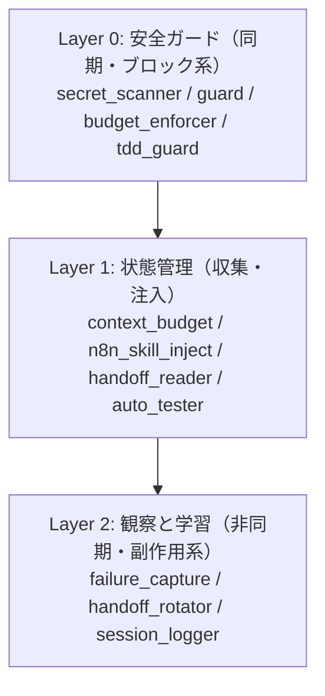

:::message
**📚 シリーズ「AIと自動化で副業システムを作る」全4回**
①hooks（本記事） / [②n8n全体像](https://zenn.dev/thinkyou0714/articles/n8n-claudecode-automation-overview) / [③Obsidian](https://zenn.dev/thinkyou0714/articles/obsidian-n8n-ai-pipeline) / [④画像パイプライン](https://zenn.dev/thinkyou0714/articles/ai-image-pipeline)
:::

## TL;DR

- Claude Code の hooks は「AIが何かをするたびに自動で走るスクリプト」。設定すれば手動指示がほぼ不要になる
- 47本実装してわかったこと：Windows環境では stdout の文字コードが罠。全フックに `sys.stdout.reconfigure(encoding="utf-8")` が必須
- `async: true` と `exit 2` は非互換。lint/guardフックに async を使うと Claude に届かなくなる
- Before: 毎セッション同じ指示を手動で10回以上 → After: 指示ゼロで全部自動実行

:::message
**検証環境**: Windows 11 + Claude Code（2026年5月時点）。hooks の仕様はバージョンで変わるので、設定前に[公式ドキュメント](https://docs.claude.com/en/docs/claude-code/hooks)で最新の挙動を確認してほしい。Mac/Linux では文字コード問題は発生しないので、その節だけ読み替えてください。
:::

:::details この記事の対象読者・前提・得られること

- **対象**: Claude Code を日常的に使い、毎セッション同じ手動指示を繰り返している人
- **前提**: Claude Code を一度は触ったことがある
- **得られること**: hooks で「指示」を「設計」に変える、5イベント別の実装パターンと落とし穴
:::

---

## なぜ47本も作ったのか

最初は3本だった。そして「もう十分」と思っていた。

「セッション開始時にコンテキストを読む」「停止時にログを書く」「危険なコマンドをブロックする」。これさえあれば Claude Code は十分賢く動く。そう信じていた。

変わったのは、ある日セッションのログを見返したときだ。俺は毎セッション、ほぼ同じセリフを言い続けていた。

```
「テストを実行して確認してから完了報告してください」
「コードを変更したらdiffを見せてください」
「secretをチャットに貼らないでください」
「API費用が高くなりすぎたら教えてください」
「n8nの操作前にスキルを確認してください」
```

正直、馬鹿らしくなった。Claude はこれだけ賢いのに、なぜ俺は毎回同じことを言っているんだ。

**「指示する」から「設計する」に変わった瞬間**、世界が変わった。指示は消耗する。設計は蓄積する。フックはその設計の器だ。

結果として47本になった。

---

## 俺がフックで何を解決したかったか

47本を作る中で気づいたのは、フックには3つの役割がある、ということだ。

```
役割1: 「させない」   → セキュリティ・ガード系
役割2: 「知らせる」   → コンテキスト注入・状態管理系
役割3: 「覚えさせる」 → ログ・ハンドオフ系
```

世の中のフック解説は「役割1」しか語らない傾向がある。危険なコマンドをブロックする、というやつだ。でも俺が一番価値を感じているのは「役割2」と「役割3」だ。

Claude Code の最大のボトルネックは、コンテキストウィンドウだと思っている。毎回「自分は誰で、今何をしているか」を伝え直す必要がある。フックはその問題を根本から解決する手段だ。

---

## フックとは何か：主要イベントと「exit 2」の話

俺が実際に使っている主要イベントは次の5つだ。

| イベント | タイミング | 主な用途 |
|---|---|---|
| `PreToolUse` | ツール実行前 | セキュリティチェック・ブロック |
| `PostToolUse` | ツール実行後 | 検証・ログ記録 |
| `UserPromptSubmit` | ユーザーが送信した瞬間 | コンテキスト注入 |
| `SessionStart` | セッション開始時 | 初期設定・状態確認 |
| `Stop` | Claude が停止するとき | 品質ゲート・ハンドオフ保存 |

:::message
ここに挙げたのは俺が使っている代表的なイベント。このほかにも `Notification` / `SubagentStop` / `PreCompact` / `SessionEnd` などがあり、**全種類とフィールドは[公式ドキュメント](https://docs.claude.com/en/docs/claude-code/hooks)が一次情報**だ。「5種類しかない」わけではない点に注意してほしい。
:::

終了コードで Claude の動作を制御できる点が肝だ。

| 終了コード | Claude の動作 |
|---|---|
| `exit 0` | 続行。**stdout がコンテキストに注入されるのは主に `UserPromptSubmit` と `SessionStart`**。多くのイベントではトランスクリプト表示に留まり、`Notification` や `SessionEnd` などは**デバッグログのみ**（通常モードでは表示されない）。Claude の判断制御は stdout の JSON（`hookSpecificOutput` の `permissionDecision` など）で行うのが正式な作法 |
| `exit 1` | 非ブロックエラーとして通知（続行） |
| `exit 2` | **ブロック**。何をブロックするかはイベント依存（`PreToolUse`=ツール実行を拒否、`Stop`=停止を阻止、`UserPromptSubmit`=プロンプトを却下）。**stderr の渡り先もイベント依存**で、`PreToolUse`/`PostToolUse`/`Stop` では Claude に渡るが、`UserPromptSubmit` では**ユーザーにのみ表示**される（プロンプトは破棄。Claude には届かない） |

`exit 2` の存在を知ったとき、「これは完全に別物だ」と思った。ただのスクリプト実行じゃない。Claude の意思決定に割り込める。

:::details 47本の内訳（カテゴリ別）

```
PreToolUse:       12本（ブロック系 / セキュリティ系）
PostToolUse:       9本（検証系 / ログ系）
UserPromptSubmit: 11本（コンテキスト注入系）
SessionStart:      8本（初期化系）
Stop:              7本（品質ゲート / ハンドオフ系）
合計:             47本
```

:::

---

## PreToolUse（12本）：「実行させない」設計

### secret_scanner.py の話

フック設計を始めるとき、「なぜ secrets を Claude に貼ってしまうのか」を考えた。

答えは単純だ。Claude が「このトークンを教えてください」と聞くから。Claude が聞いて、人間がチャットに貼る。そのタイミングで漏洩する。

だから解決策は「貼る前に止める」ではなく「貼ったことを検知して爆発させる」だ。フック経由で Claude が自分の発言やコマンドに secrets が含まれていたら、即 exit 2 でブロックする。

```python:secret_scanner.py
import sys
import re
import json

sys.stdout.reconfigure(encoding="utf-8")
sys.stderr.reconfigure(encoding="utf-8")

PATTERNS = [
    r'sk-(?:proj-)?[a-zA-Z0-9_-]{20,}',  # OpenAI API key（sk- / sk-proj- 新旧両形式）
    r'sk-ant-[a-zA-Z0-9_-]{20,}',        # Anthropic API key（sk-ant-api03-... 等）
    r'xox[baprs]-[0-9a-zA-Z-]{10,}',     # Slack Token（bot/user/app/refresh/legacy）
    r'gh[pousr]_[a-zA-Z0-9]{36,}',       # GitHub Token（PAT / OAuth / App / refresh）
    r'AKIA[A-Z0-9]{16}',                 # AWS Access Key
]

input_data = json.loads(sys.stdin.read())
tool_input = str(input_data.get('tool_input', {}))

for pattern in PATTERNS:
    if re.search(pattern, tool_input):
        print(f"[BLOCK] secrets detected.", file=sys.stderr)
        sys.exit(2)

sys.exit(0)
```

これを入れてから、秘密情報の誤出力事故はゼロになった。

:::message alert
この正規表現は万能ではない。`sk-proj-` 系の新しい OpenAI キー形式など、**検知漏れは前提**だと考えておくべきだ。フックは最終防衛線ではなく多層防御の一枚目にすぎない。なお `exit 2` の stderr にキー本体を出力しないこと（ログに残ってしまう）。
:::

### budget_enforcer.py の話

API コストで痛い目に遭ったことがある。知らないうちに1日で数千円を使っていた。

Anthropic は API 使用量の警告メールを送ってくれるが、それは「使った後」の話だ。セッション中にリアルタイムで「今日の使用量がやばい」を知りたかった。

```python:budget_enforcer.py
DAILY_LIMIT_JPY = int(os.environ.get('CLAUDE_DAILY_BUDGET_JPY', '500'))

if estimated_cost_jpy > DAILY_LIMIT_JPY * 0.8:
    print(f"[WARNING] 本日のAPI使用量が上限の80%を超えました: ¥{estimated_cost_jpy:.0f} / ¥{DAILY_LIMIT_JPY}")
```

---

## UserPromptSubmit（11本）：「知らせる」設計

### n8n_skill_inject.py の話

n8n のワークフローを触るたびに、俺は同じ指示をしていた。「コードノードでは `process.env` は使えないから `$env` を使ってください」「`new URL()` もサンドボックス制約で使えないです」。

これを10回以上繰り返したとき、頭おかしいなと思った。こんな情報はフックで自動注入すれば一回で済む。

```python:n8n_skill_inject.py
N8N_KEYWORDS = ['n8n', 'WF-', 'ワークフロー', 'n8n_workflows']

prompt = input_data.get('prompt', '')
if any(kw in prompt for kw in N8N_KEYWORDS):
    skill_content = read_skill('n8n-wf-deploy')
    print(f"[Context] n8n スキルを注入しました:\n{skill_content[:500]}")
```

今は n8n に関わる作業を始めると、自動でスキルドキュメントが渡される。俺は何も言わなくていい。

### context_budget.py の話

コンテキストが詰まっているのに気づかず作業を続けて、後半の Claude の品質が明らかに落ちていた経験がある。コンテキスト圧迫は静かに進行する。

```python:context_budget.py
print(f"""
=== Context Budget ===
使用量: {usage_tokens:,} / {total_tokens:,} tokens ({usage_pct:.1f}%)
{"[WARNING] 60% を超えました。/compact を推奨します。" if usage_pct > 60 else "OK"}
HOT layer: {hot_size_kb:.1f} KB（目標 50KB 以下）
""")
```

セッション開始時にこれが表示されるようになってから、「気づいたら詰まってた」という事態がなくなった。

---

## Stop（7本）：「覚えさせる」設計

### tdd_guard.py の話

「テストが通ってないのに完了したと言う」問題は、Claude Code の初期に俺が一番困ったことだ。

コードを書き、動作確認をして、「完了しました」と言う。でもテストを実行していない。後で CI が落ちて、何が変わったのかを追うことになる。

フックで強制的に止めるようにした。

```python:tdd_guard.py
if has_changed_files and test_files_exist:
    result = subprocess.run(['npm', 'test', '--passWithNoTests'],
                           capture_output=True, text=True, timeout=60)
    if result.returncode != 0:
        print(f"[BLOCK] テストが失敗しています。修正してから完了報告してください。\n{result.stdout[-500:]}", 
              file=sys.stderr)
        sys.exit(2)
```

これ以降、「テスト確認してください」という指示を一度も言っていない。

### failure_capture.py の話

Claude Code を使い始めた頃、同じ失敗を何度も繰り返していることに気づいた。「n8n のコードノードで `process.env` を使おうとして失敗」「Windows の文字コード問題」。毎回同じところで詰まる。

失敗を記録して分類することにした。今は19カテゴリで自動分類している。

:::details 19カテゴリの一覧

```
1.  encoding_error        - 文字コード関連
2.  import_error          - モジュール import 失敗
3.  api_rate_limit        - API レート制限超過
4.  file_not_found        - ファイルパス誤り
5.  git_conflict          - git マージ競合
6.  test_failure          - テスト失敗
7.  type_error            - 型エラー
8.  permission_denied     - アクセス権限エラー
9.  timeout               - タイムアウト
10. n8n_code_node_error   - n8n Code ノードエラー
11. context_overflow      - コンテキストウィンドウ超過
12. secret_leak_attempt   - secrets 漏洩の試み（ブロック）
13. hallucination         - 存在しないファイル/APIの参照
14. scope_creep           - スコープ外の変更
15. regression            - 既存機能の破壊
16. lint_failure          - lint/typecheck エラー
17. deploy_failure        - デプロイエラー
18. migration_error       - DB マイグレーション失敗
19. dependency_conflict   - パッケージ依存関係の競合
```

:::

蓄積した失敗パターンをもとに、次のセッションでは「これは失敗パターン10番に似ています」と自動でヒントが出るようになった。「AIに教わる」から「AIが過去の俺から学ぶ」への転換だ。

---

## Windows 環境で全フックが無音で失敗していた件

:::message alert
**Windows ユーザー必読。** この問題を知らないと、フックを実装しても「全部正常に動いているように見えて、実は何もしていない」状態になる。
:::

実装した後しばらく、「フックを設定したのに効いていない気がする」という違和感があった。

原因を探るのに丸1日かかった。

結論は単純だった。**日本語を含む `print()` が全部 Windows の cp932（Shift-JIS）で `UnicodeEncodeError` を起こし、`except` に飲まれ、無言で `exit 0` していた**。

エラーが出ない。ログも残らない。フックは「実行された」ことになっている。でも何も出力されていない。

```python
# NG: Windows では cp932 で UnicodeEncodeError が発生する
def main():
    print("セキュリティチェック開始")  # 無音で失敗する

# OK: 全フックの先頭に必ず書く（呪文）
import sys
sys.stdout.reconfigure(encoding="utf-8")
sys.stderr.reconfigure(encoding="utf-8")

def main():
    print("セキュリティチェック開始")  # 正常に出力される
```

「実装したフックが全部動いていなかった」と気づいたときのダメージは、思ったより大きかった。37本を一括修正した。

:::message
subprocess を呼ぶ場合も同様。`env['PYTHONIOENCODING'] = 'utf-8'` を忘れると同じ問題が起きる。
:::

---

## `async: true` と `exit 2` は非互換だった

:::message alert
**lint/guardフックに `async: true` を付けてはいけない。** ブロックできなくなる。
:::

`async: true` を付けたフックはバックグラウンドで動く。バックグラウンドプロセスの終了コードは Claude に届かない。つまり `exit 2` を出しても、Claude は気づかずに動き続ける。

これに気づかず「なぜブロックされないんだ」と30分悩んだ。

```json:settings.json（NG例）
{
  "hooks": {
    "PreToolUse": [{
      "matcher": "Bash",
      "hooks": [{ "type": "command", "command": "python lint_check.py", "async": true }]
    }]
  }
}
```

```json:settings.json（OK例）
{
  "hooks": {
    "PreToolUse": [{
      "matcher": "Bash",
      "hooks": [{ "type": "command", "command": "python lint_check.py" }]
    }]
  }
}
```

俺のルールはシンプルだ。「Claude を止める可能性があるフックに async は使わない」。ログ記録や Slack 通知には使っていい。

| フック種別 | async | 理由 |
|---|---|---|
| lint/guard（exit 2 使用） | **NG** | 終了コードが届かない |
| ログ記録 | OK | 待つ必要がない |
| Slack 通知 | OK | 待つ必要がない |

:::message
（追記）新しめの Claude Code には、非同期で動かしつつブロックも扱える仕組みが追加されている。使う前に公式ドキュメントで最新の挙動を確認してほしい。本記事の方針は「確実にブロックしたいフックは同期実行」という安全側の運用だ。
:::

---

## フック設計のアーキテクチャ：Layer 0 → Layer 2

47本を設計する中で自然とレイヤー構造が生まれた。



Layer 0 を起点に設計する。守りが固まったら Layer 1 で「賢くする」。最後に Layer 2 で「学習させる」。この順番を守らないと、守りの甘いまま複雑なシステムになる。

---

## 実装前後の変化

正直に言うと、一番変わったのは「セッションを始めるときのストレス」だ。

以前は毎回「テスト確認して、diff見せて、secretは貼らないで、コスト気にして」と、セットアップに使うターンが最低3〜4回あった。今はゼロだ。セッション開始と同時に本質的な作業に入れる。

| 指示の種類 | Before | After |
|---|---|---|
| テスト確認 | 毎セッション手動 | `auto_tester.py` が自動実行 |
| diff 確認 | 毎セッション手動 | `PostToolUse` で自動表示 |
| secret 非貼付 | 毎セッション手動 | `secret_scanner.py` が自動ブロック |
| コスト確認 | 毎セッション手動 | `budget_enforcer.py` が自動警告 |
| n8n スキル確認 | n8n 操作前に毎回 | `n8n_skill_inject.py` が自動注入 |

数えると毎セッション10回以上言っていた。今は0回だ。

:::message
（数字の出どころ）「10回以上」は `session_logger.py` のログから、繰り返し型の指示発話を数えた俺の環境での実測値。「47本」は `.claude/hooks/` 配下のスクリプト数。環境によって変わるので、絶対値ではなく傾向として読んでほしい。
:::

---

## 次にやること

失敗パターンの分類は現在19カテゴリ。これをもとに `/evolve` スキルが学習候補を自動提案する仕組みを作っている。

目標は「同じ失敗を繰り返さない Claude」だ。正確に言えば「俺自身の失敗から学習し続けるシステム」だ。

フックの全コードはTHINK YOU LABのコミュニティで共有予定。

---

## 関連記事

このシステム全体の設計については以下を参照してほしい。

- [n8n × Claude Code で55本のWFを動かしている：副業自動化システムの全体像](https://zenn.dev/thinkyou0714/articles/n8n-claudecode-automation-overview)
- [ObsidianをAIの第二の脳にした：7本のn8nワークフローで作ったナレッジ自動管理システム](https://zenn.dev/thinkyou0714/articles/obsidian-n8n-ai-pipeline)
- [記事のOGP・図解・サムネを全部AIに作らせた：n8n × Claude Code × Satori の画像生成パイプライン](https://zenn.dev/thinkyou0714/articles/ai-image-pipeline)

---

## 更新履歴

- **2026-05-25**: hooks のイベント種別（「5種類」→「主要5種＋他多数」）と exit code の挙動説明を公式仕様に合わせて修正。`async` × `exit 2` の節に最新版の補足を追記。secret 検知の限界（検知漏れ前提・多層防御）を明記。Layer 構成図を Mermaid 化。
- **2026-05-25**: シリーズ導線・「対象読者/前提/得られること」ブロック・数字の計測方法の注記を追加。
- **2026-05-25**: exit code の挙動をイベント依存として精緻化（`exit 0` の stdout 表示先、`exit 2` の stderr 渡り先は `UserPromptSubmit` ではユーザーのみ等）。
- **2026-05-25**: 記事間リンクをルート相対（`/articles/`）からフルURL（`zenn.dev/...`）に修正し、404リスクを解消。

---

## THINK YOU LABについて

AIと自動化で副業システムを構築するコミュニティ「THINK YOU LAB」を運営しています。
Claude Code / n8n / Obsidianを活用した実践的なワークフローをブログで公開中。

→ **[think-you-lab.vercel.app](https://think-you-lab.vercel.app)**
